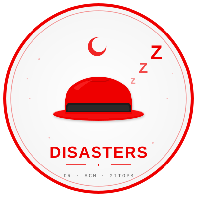

# Sleeping Through Disasters

**Odoo 19 kept continuously available across the loss of an entire cloud region — deployed to two OpenShift clusters on two different hyperscalers by Red Hat Advanced Cluster Management and GitOps.**

<p align="center">
  
</p>

---

## The objective

A firm's business of record — its ERP — stays available to its users through the loss of an entire cloud region, with its irreplaceable customer data, documents, configuration and credentials preserved, at the lowest standby cost that meets the firm's chosen availability bar.

And the platform claim underneath it: **OpenShift is the constant.** The same manifests deploy unchanged on AWS, on Azure, or on-premise. The hyperscaler below and the global load balancer above are both commodity and swappable.

## Why Odoo

The pattern needs a genuinely stateful, mission-critical application — one with a relational database of record, irreplaceable configuration, and user-uploaded documents that cannot be regenerated. Odoo Community is exactly that: a production ERP and CRM holding customers, quotes, invoices and attachments. If it goes dark, the business stops invoicing.

It is also **PostgreSQL-native**, which is what lets CloudNativePG do real work here rather than being decoration.

The workload image comes from [`odoo-on-openshift`](https://github.com/ryannix123/odoo-on-openshift) — Odoo 19 Community rebuilt on Red Hat UBI 10, running as an arbitrary non-root UID under the `restricted-v2` SCC.

## Dependency rule

**Red Hat products and upstream CNCF projects only.**

| Layer | Component | Provenance |
|---|---|---|
| Platform | OpenShift | Red Hat |
| Multi-cluster management | Advanced Cluster Management | Red Hat |
| GitOps | OpenShift GitOps (Argo CD) | Red Hat |
| Cross-cluster networking | Service Interconnect (Skupper) | Red Hat |
| Volume replication | VolSync | Red Hat |
| Namespace backup | OADP (Velero) | Red Hat |
| Application base image | UBI 10 | Red Hat |
| Database | CloudNativePG | CNCF (Apache 2.0) |

Red Hat is not a database vendor, so the database operator is the one CNCF component. CloudNativePG runs on **any** CSI driver, which keeps the pattern free of a storage-vendor dependency — the pure Red Hat + CNCF stack is the *more* portable choice at the storage layer, not the less.

## Architecture

```
                        ┌────────────────────────────────┐
                        │   Hub Cluster (ACM + GitOps)   │
                        │   Watches this repo →          │
                        │   ApplicationSets → Argo CD    │
                        └───────────────┬────────────────┘
                      reconciles        │        reconciles
              ┌──────────────────────────┴──────────────────────────┐
              ▼                                                     ▼
   ┌────────────────────────┐                        ┌────────────────────────┐
   │  ACTIVE  (role=active) │                        │ PASSIVE (role=passive) │
   │  hyperscaler A         │                        │ hyperscaler B          │
   │                        │                        │                        │
   │  Odoo         × 1      │                        │  Odoo         × 0      │
   │  CNPG primary + sync   │◀── WAL over the VAN ──▶│  CNPG replica cluster  │
   │  Interconnect Site     │    (mTLS, outbound)    │  Interconnect Site     │
   │  VolSync Source ───────┼──▶  object storage ◀───┼── VolSync Destination  │
   └────────────────────────┘                        └────────────────────────┘
              ▲                                                     ▲
              └───────────── Cloudflare load balancer ──────────────┘
                       health checks → automatic traffic failover
```

## Two-tier database replication

| Tier | Scope | Mode | Protects against | RPO |
|---|---|---|---|---|
| 1 | Second PostgreSQL instance in the active cluster | **Synchronous** | Node / AZ failure | **0**, promotion automatic |
| 2 | Replica cluster on the passive site | **Asynchronous** over the VAN | Region / cluster loss | seconds, promotion controlled |

Cross-region replication stays asynchronous deliberately. Making it synchronous would add cross-cloud round-trip latency to every write and halt production writes whenever the WAN link or the passive cluster degrades. We take RPO 0 where it is cheap, and accept seconds where synchronous would be fragile.

## Repository layout

```
sleeping-through-disasters/
├── hub/                      Hub bootstrap — run once
│   ├── 01-managedclusterset.yaml   Groups both clusters into "odoo-dr"
│   ├── 02-placement-active.yaml    Selects role=active
│   ├── 03-placement-passive.yaml   Selects role=passive
│   ├── 04-placement-both.yaml      Selects the whole set
│   └── 05-gitopscluster.yaml       Wires ACM placements → Argo CD
│
├── applicationsets/          One ApplicationSet per component per role
│
├── clusters/
│   ├── both/                 Operators + namespace (both clusters)
│   ├── active/               Primary DB, Connector, Odoo ×1, VolSync Source
│   └── passive/              Replica DB, Listener, Odoo ×0, VolSync Destination
│
├── ansible/                  Build-time automation (hub, secrets, link, Cloudflare)
├── container/                Odoo image (forked, DR-adjusted)
├── .github/workflows/        Image build + manifest validation
├── policies/                 ACM compliance policies
└── docs/
    ├── ARCHITECTURE.md       Design decisions and trade-offs
    ├── BOOTSTRAP.md          Step-by-step first deployment
    └── FAILOVER.md           DR runbook
```

## How it works

Cluster **labels** drive everything:

```bash
oc label managedcluster <cluster-a> cluster.open-cluster-management.io/clusterset=odoo-dr
oc label managedcluster <cluster-b> cluster.open-cluster-management.io/clusterset=odoo-dr
oc label managedcluster <cluster-a> role=active
oc label managedcluster <cluster-b> role=passive
```

Three ACM `Placement` resources resolve those labels to clusters. Each ApplicationSet uses the `clusterDecisionResource` generator to create one Argo CD `Application` per matched cluster, pointed at the matching folder in this repo. Argo CD then reconciles continuously, so the passive site can never quietly drift out of readiness.

## Quick start

Two ways in.

**Automated** — the Ansible layer handles hub operators, cluster import, the
secrets, the Interconnect token transfer, and Cloudflare:

```bash
cd ansible
ansible-galaxy collection install -r requirements.yml
ansible-playbook playbooks/00-generate-secrets.yml   # generate + seal the vault
ansible-vault edit group_vars/all/vault.yml          # add S3 + Cloudflare values
ansible-playbook site.yml
```

**By hand** — if you would rather see each step:

```bash
# On the hub, with ACM and OpenShift GitOps already installed:
oc apply -k hub/
oc apply -k applicationsets/
oc apply -k policies/          # optional, compliance reporting
```

Full walkthrough either way, including the three secrets that are deliberately
**not** in Git and the one-time Interconnect token transfer:
**[docs/BOOTSTRAP.md](docs/BOOTSTRAP.md)**. The automation boundary — what
Ansible owns versus what Argo CD owns — is in **[ansible/README.md](ansible/README.md)**.

## Failover in one line

Traffic failover is automatic — Cloudflare health checks shift DNS to the passive cluster within a few minutes, with no human involved.

Promoting the application is a Git commit. In `clusters/passive/postgres/cluster.yaml`:

```yaml
spec:
  replica:
    enabled: false     # was true
```

and in `clusters/passive/odoo/odoo.yaml`, `replicas: 1`. Commit, push, and Argo CD does the rest.

Database promotion is deliberately **not** automatic by default: if the active region is only network-partitioned rather than genuinely gone, automatic promotion creates split-brain. **[docs/FAILOVER.md](docs/FAILOVER.md)** covers the full runbook and the safe path to automating this step.

## Recovery objectives

| Scope | RPO | RTO |
|---|---|---|
| Pod / node / AZ failure | 0 | seconds, automatic |
| Region / cluster loss — database | seconds | 5–10 minutes |
| Region / cluster loss — filestore | ~2 minutes (VolSync interval) | ~10 minutes |
| Both regions lost | 24 hours (OADP) | hours |

## The container

This repo builds and owns its own Odoo image, forked from
[odoo-on-openshift](https://github.com/ryannix123/odoo-on-openshift) and
adjusted for multi-cluster DR. It lives in `container/`.

```
quay.io/ryan_nix/odoo-openshift-dr:19.0
```

This is a **separate Quay repository** from `odoo-openshift`, not a tag suffix on the
same one. Both push floating tags (`19`, `latest`), so sharing a repository would let
the two pipelines overwrite each other's — whichever ran last would win, and a `latest`
pull would silently return whichever variant. Separate repositories keep the timelines
independent; the layers are content-addressed, so there is no duplicated storage.

The image is rebuilt weekly from the Odoo branch tip, and the tags float. That is
deliberate for a reference pattern: it keeps the demo current with upstream and with UBI
security updates. It does mean a pod restart can pull a newer build than the one you
rehearsed against — see [docs/FAILOVER.md](docs/FAILOVER.md#before-a-live-demo) for the
handful of things to do before a live demo.

Two behaviours were added to the entrypoint for this pattern:

**Standby guard.** A CloudNativePG replica accepts connections but is
read-only. Rather than failing confusingly, the container detects
`pg_is_in_recovery()` and waits for promotion — which matters during failover,
when Odoo can be scheduled before the database finishes promoting.

**`ATTACHMENT_LOCATION`.** Set it to `db` and Odoo stores attachments in
PostgreSQL instead of the filestore, so they ride the same replication stream
as the rest of the data. That closes the window where the promoted database
references files VolSync has not yet copied. Default is `file`; see
[docs/ARCHITECTURE.md](docs/ARCHITECTURE.md) for when to change it.

Everything else — UBI 10 base, arbitrary non-root UID, wkhtmltopdf with
patched Qt — is unchanged from upstream.

```bash
cd container
podman build --platform linux/amd64 --build-arg ODOO_VERSION=19.0 \
  -t quay.io/ryan_nix/odoo-openshift-dr:19.0 -f Containerfile .
```

## CI

| Workflow | Runs on | Does |
|---|---|---|
| `build-image.yml` | changes under `container/`, weekly, manual | Builds and pushes the Odoo image to Quay (`19.0`, `19`, `latest`) |
| `validate-manifests.yml` | any manifest change, every PR | `kustomize build` on every overlay, then checks the DR invariants |

The second one matters more than it looks. In a GitOps repo the manifests
*are* the deployment, so a typo is an outage on the passive cluster that
nobody notices until failover. It checks that every ApplicationSet points at a
path and a Placement that exist, that the Interconnect routing keys and hosts
still line up across the two sites, that the active database keeps its
synchronous replica, and that Odoo is never scaled past one replica on a
ReadWriteOnce filestore. It also flags any commit that flips the passive
database out of replica mode — a promotion should be a deliberate, reviewed
change, not something that slips through.

## Related repository

[odoo-on-openshift](https://github.com/ryannix123/odoo-on-openshift) — the
upstream single-cluster deployment this container was forked from.

## Author

Ryan Nix — this is a personal project, not an official Red Hat solution.
