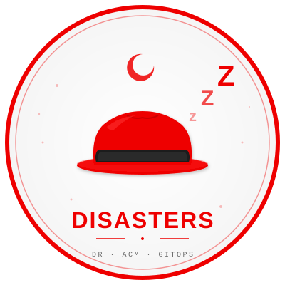
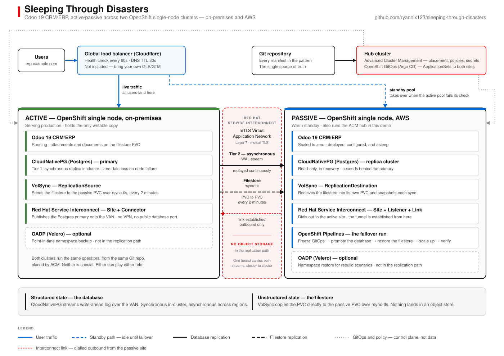

# Sleeping Through Disasters

**Odoo 19 kept continuously available across the loss of an entire region — deployed to two OpenShift clusters, one on-premises and one on a hyperscaler, by Red Hat Advanced Cluster Management and GitOps.**

<p align="center">
  
</p>

---

## The objective

A firm's business of record — its ERP — stays available to its users through the loss of an entire region, with its irreplaceable customer data, documents, configuration and credentials preserved, at the lowest standby cost that meets the firm's chosen availability bar.

And the platform claim underneath it: **OpenShift is the constant.** The same manifests deploy unchanged on AWS, on Azure, or on bare metal in your own building. The substrate below and the global load balancer above are both commodity and swappable.

## Status

This pattern has been **deployed from scratch and failed over end to end**, on a fresh deployment rather than a long-lived one — which is the only test that finds the defects that hide in steady state. It found ten of them. They are fixed, and recorded in [docs/DESIGN-DECISIONS.md](docs/DESIGN-DECISIONS.md).

| | |
|---|---|
| Traffic failover | Automatic — Cloudflare health checks, no human |
| Database promotion | Automated by pipeline, **gated off by default** (`auto_promote`) |
| Filestore restore | Automated by pipeline |
| Return to steady state | Automated — `97-reset-after-failover.yml` |
| Return-to-origin preserving post-failover writes | **Not yet built** — next piece of work |

The gate defaults to `false`. That is a deliberately conservative configuration, not the recommended ceiling — see [Failover](#failover). A clean lights-out run with `auto_promote=true`, from detection through to serving with zero human touches, has not yet been recorded. Until it has, no headline RTO is quoted here.

> **This branch (`validated-pattern`) is the [Validated Patterns](https://validatedpatterns.io/)
> edition, being prepared for the Sandbox tier.** It installs with the
> framework's `./pattern.sh make install`, uses the standard clustergroup chart,
> and keeps secrets in Vault. The pattern logic is the same as `main`, which
> still holds the original Ansible + ApplicationSet layout and is what the
> results above were measured on. **This layout renders and validates in CI but
> has not yet been deployed end to end** — see [Known gaps](#known-gaps).

## Why Odoo

The pattern needs a genuinely stateful, mission-critical application — one with a relational database of record, irreplaceable configuration, and user-uploaded documents that cannot be regenerated. Odoo Community is exactly that: a production ERP and CRM holding customers, quotes, invoices and attachments. If it goes dark, the business stops invoicing.

It is also **PostgreSQL-native**, which is what lets CloudNativePG do real work here rather than being decoration.

The workload image comes from [`odoo-on-openshift`](https://github.com/ryannix123/odoo-on-openshift) — Odoo 19 Community rebuilt on Red Hat UBI 10, running as an arbitrary non-root UID under the `restricted-v2` SCC.

## Dependency rule

**Red Hat products and upstream CNCF projects only.**

| Layer | Component | Provenance |
|---|---|---|
| Platform | OpenShift | Red Hat |
| Multi-cluster management | Advanced Cluster Management | Red Hat |
| GitOps | OpenShift GitOps (Argo CD) | Red Hat |
| Cross-cluster networking | Service Interconnect (Skupper) | Red Hat |
| Volume replication | VolSync | Red Hat |
| Failover automation | OpenShift Pipelines (Tekton) | Red Hat |
| Namespace backup | OADP (Velero) | Red Hat |
| Application base image | UBI 10 | Red Hat |
| Database | CloudNativePG | CNCF (Apache 2.0) |

Red Hat does not ship a supported Kubernetes PostgreSQL operator, so the database operator is the one CNCF component. CloudNativePG runs on **any** CSI driver, which keeps the pattern free of a storage-vendor dependency — the Red Hat + CNCF stack is the *more* portable choice at the storage layer, not the less.

Remove any one of these and a real capability breaks. That is an honest "better together" story, not a SKU list.


### Products and versions

Operators follow the default channel of each cluster's catalog (no channel is
pinned in `values-*.yaml`), so the installed version tracks the OpenShift
release. What the pattern itself pins:

| Component | Version | Where it is set |
|---|---|---|
| Validated Patterns clustergroup chart | `0.9.*` | `values-global.yaml` |
| Validated Patterns ACM / Vault / ESO charts | `0.2.*` / `0.1.*` / `0.0.*` | `values-hub.yaml` |
| PostgreSQL (CloudNativePG operand) | 16.6 | `charts/odoo-database/values.yaml` |
| Odoo Community | 19.0 | `charts/odoo-app/values.yaml` |

Tested with OpenShift 4.22, Advanced Cluster Management 2.17 and Red Hat
Service Interconnect 2.2.2 on the `main` layout. The full operator version list
is recorded with each validation run.

## Architecture

<p align="center">
  
</p>

The diagram shows the full pattern. Three things worth reading off it:

**The database is protected in two tiers** — synchronous between the local instances on the active cluster (RPO 0 for a node or AZ loss) and asynchronous across the Service Interconnect VAN to the passive cluster (seconds of RPO for a region loss, and it never blocks a production write).

**There is no object storage in the replication path.** VolSync copies the filestore PVC directly to the passive PVC over rsync-tls, inside the same mTLS tunnel the database uses. No bucket, no credentials to rotate, no third failure domain, no egress bill. OADP is present and optional, for point-in-time namespace recovery — a different job from replication.

**The hub rides with the passive site**, so the management plane survives the outage it has to respond to.

On a single-node demo the in-cluster synchronous tier folds to one instance; see [docs/DEMO-TOPOLOGY.md](docs/DEMO-TOPOLOGY.md).

## Two-tier database replication

| Tier | Scope | Mode | Protects against | RPO |
|---|---|---|---|---|
| 1 | Second PostgreSQL instance in the active cluster | **Synchronous** | Node / AZ failure | **0**, promotion automatic |
| 2 | Replica cluster on the passive site | **Asynchronous** over the VAN | Region / cluster loss | seconds, promotion gated |

Cross-region replication stays asynchronous deliberately. Making it synchronous would add cross-cloud round-trip latency to every write and halt production writes whenever the WAN link or the passive cluster degrades. We take RPO 0 where it is cheap, and accept seconds where synchronous would be fragile.

## Repository layout

```
sleeping-through-disasters/
├── values-global.yaml          Pattern name, sizing profile, public hostname, Cloudflare toggle
├── values-hub.yaml             Hub clustergroup: ACM, Vault, ESO — and the PASSIVE site
├── values-active.yaml          Active clustergroup (managed cluster, clusterGroup=active)
├── values-secret.yaml.template Secrets to load into Vault (copy to ~, never commit)
├── pattern-metadata.yaml       Identity, tier, sizing for validatedpatterns.io
├── pattern.sh, Makefile*       The framework installer (runs in the utility container)
├── overrides/                  Sizing profiles: standard, sno
├── charts/
│   ├── odoo-database/          CNPG primary (active) or cross-cluster replica (passive)
│   ├── odoo-interconnect/      Service Interconnect Site, Connectors, Listeners
│   ├── odoo-filestore/         VolSync rsync-tls source (active) / destination (passive)
│   ├── odoo-app/               Odoo — serving (active) or pilot light (passive)
│   ├── odoo-failover/          Tekton failover pipeline + optional Cloudflare triggers
│   └── odoo-dr-governance/     ACM policies reporting the DR posture
├── ansible/
│   ├── imperative/             Jobs the framework runs every 10 min: Skupper link + self-heal
│   └── playbooks/              Day-two tools: preflight, diagnose, verify, Cloudflare
├── tests/dr/                   Render-and-check DR invariants (CI and `make validate-dr`)
├── container/                  Odoo image (forked, DR-adjusted)
└── docs/                       Architecture, design record, failover runbook, validation
```

## How it works

The pattern is two **clustergroups**. The Validated Patterns operator installs
OpenShift GitOps on the hub and points it at `values-hub.yaml`; the framework's
ACM chart then does the same for every managed cluster labelled
`clusterGroup=active`, which pulls `values-active.yaml` into its own Argo CD.
Each site therefore reconciles itself: losing the hub does not stop the active
site, and losing the active site leaves the hub — the recovery site — fully in
control.

The same six charts serve both sites; a `role` value (`active` or `passive`)
selects the primary or replica database, Connector or Listener, VolSync source
or destination, and serving or pilot-light Odoo.

Two things cannot be declared in Git, and run as the framework's **imperative
jobs** instead (`ansible/imperative/`, every 10 minutes, idempotent):

- **The Service Interconnect link.** A grant is minted at runtime and each
  token is single-use. The hub issues the grant on the active site through an
  ACM `ManifestWork`, reads its URL, code and CA back through status feedback,
  and redeems it locally. No kubeconfig for the active site exists anywhere.
- **Skupper self-healing.** A wedged controller after a reboot, and a router
  still serving a certificate the controller has replaced, are both detected
  and repaired, with built-in rate limits.

The VolSync rsync-tls key is *not* copied between clusters: Vault generates it
once and External Secrets delivers it to both sites, as VolSync's own
documentation recommends for GitOps.

## Protecting the data plane from the control plane

Continuous reconciliation is a virtue right up until the moment Argo decides
your database is drift. Two rules keep it from being one:

- Every data-bearing resource — both CNPG `Cluster`s, the `odoo-data` PVC, the
  VolSync destination and the `odoo` Namespace — carries
  `argocd.argoproj.io/sync-options: Prune=false,Delete=false`, so neither a
  prune nor deleting an Application removes it.
- The passive `odoo-database` and `odoo-app` Applications ignore exactly the
  fields a failover changes (`/spec/replica/enabled`, `/spec/replicas`) with
  `RespectIgnoreDifferences`. On the `main` layout the pipeline had to freeze
  ApplicationSets mid-failover — Argo once reverted a promotion within seconds.
  Here the protection is declarative, the pipeline's first step verifies it is
  in place before touching anything, and CI fails any change that removes it.

GitOps owns the desired state of the platform. It does not own the right to destroy the customer's data.

## Install

**You need:** two OpenShift clusters (4.20 or later), ideally in different
clouds or regions; `podman` and `git` on your workstation; a fork of this
repository. One cluster becomes the hub *and* the passive site; the other is
the active site. Single-node OpenShift works for both — set
`global.odooDR.sizing: sno` in `values-global.yaml`.

```bash
git clone https://github.com/<you>/sleeping-through-disasters.git
cd sleeping-through-disasters && git checkout validated-pattern

# 1. Secrets: everything is generated unless you enable Cloudflare.
cp values-secret.yaml.template ~/values-secret-sleeping-through-disasters.yaml

# 2. Install on the hub (logged in to the hub cluster).
./pattern.sh make install

# 3. Import the active site into ACM as clusterGroup=active.
VP_HUBCONFIG=~/.kube/hub.config VP_SPOKECONFIG=~/.kube/active.config \
  ./pattern.sh make import-active
```

The active site's Argo CD appears a few minutes after the import, then the
operators, database, Interconnect site and Odoo. The hub's `skupper-link` job
links the two sites on its next run (within 10 minutes of both Sites being
Ready); replication starts as soon as the link is up. Watch it with
`oc get cronjob,job -n imperative` on the hub, and confirm end to end with
`ansible/playbooks/98-diagnose.yml`.

Before installing on clusters that have been shut down for a while, run
`ansible/playbooks/00-preflight.yml`: it approves stuck kubelet CSRs, sets a
default VolumeSnapshotClass where one is missing, and reports pod headroom.

**Storage classes:** everything uses each cluster's default StorageClass and
VolumeSnapshotClass (`00-preflight.yml` sets a missing default snapshot class).
To pin them for one site — LVM Storage on single-node, for example — add them
at the top level of that site's clustergroup file, which every chart on that
site receives:

```yaml
# in values-active.yaml (active site) or values-hub.yaml (passive site)
volsync:
  storageClass: lvms-vg1
  volumeSnapshotClass: lvms-vg1
```

**Optional — Cloudflare edge failover:** set `global.odooDR.cloudflare.enabled:
true` and `publicHostname`, uncomment the `cloudflare` secret, re-run
`./pattern.sh make load-secrets`, then create the load balancer with
`ansible/playbooks/06-cloudflare.yml`.

## Failover

With the optional Cloudflare integration, traffic failover is automatic:
health checks shift DNS to the passive cluster within a few minutes, with no
human involved. Without it, a person repoints DNS or the load balancer. Either
way, traffic alone lands users on an Odoo that is scaled to zero. **The application has to be woken up, and the
data has to be made writable and complete.** That is what the pipeline does.

Five Tekton Tasks on the passive cluster, in order:

| Task | Why it exists |
|---|---|
| `dr-suspend-gitops` | Verifies the passive Applications ignore the fields a promotion changes, and aborts before touching anything if they do not. Without that protection, Argo reverts the promotion mid-failover. |
| `dr-promote-database` | Clears `replica.enabled`, waits for the replica to leave recovery, syncs the app role password into the app Secret |
| `dr-restore-filestore` | Rebuilds the app PVC from VolSync's latest snapshot. **Skipping this gives you a promoted database whose attachments are not there.** |
| `dr-scale-application` | Scales Odoo to 1 and waits for `/web/health` |
| `dr-verify` | Confirms the site is actually serving |

With Cloudflare enabled, the pipeline is started by an `EventListener`, fed by a poller that requires
**two independent signals** before it will act: edge health from Cloudflare, and
`pg_stat_wal_receiver` on the replica. One signal is an opinion; two is evidence.

Whether it promotes without a human is one key in one ConfigMap:

```bash
oc patch configmap dr-failover-config -n odoo --type merge \
  -p '{"data":{"auto_promote":"true"}}'
```

Default is `false`. If the active region is only network-partitioned rather than
genuinely gone, promotion on an ambiguous signal creates split-brain — and from
the passive site, "active is dead" and "I can't currently reach active" look
identical. Two-signal detection is what makes `true` defensible rather than
reckless. The pattern ships the capability because *Sleeping Through Disasters*
is a claim, and the claim is only true if the system can fail over with nobody
watching.

Without Cloudflare, start it by hand on the hub:

```bash
tkn pipeline start dr-failover -n odoo -p source=manual -p auto_promote=true \
  --use-param-defaults --serviceaccount dr-failover --showlog
```

After a test failover, `ansible/playbooks/97-reset-after-failover.yml` returns
to steady state on the `main` layout: it disables the active pool at the edge
**before** the old site powers on — that database still believes it is primary
— rebuilds the passive as a fresh replica, and resets the gate. It has not yet
been ported to this layout (see [Known gaps](#known-gaps)). It discards post-failover
writes, which is correct for testing and wrong for production. A true
return-to-origin that preserves them is the next piece of work.

Full runbook: **[docs/FAILOVER.md](docs/FAILOVER.md)**.

## Recovery objectives

Measured on a fresh deployment, not estimated.

| Scope | RPO | Recovery |
|---|---|---|
| Pod, node or AZ failure | **0** — synchronous replica | seconds, automatic |
| Region loss — database | seconds (12–13 s steady-state lag) | promotion completes in **7 s** |
| Region loss — filestore | up to 2 min (the VolSync interval) | restored from snapshot inside the pipeline |
| Both regions lost | **not implemented** — no scheduled backup ships in this repo yet | — |

End-to-end, the mechanical path is roughly five minutes and is **dominated by
detection, not recovery**: about 3 minutes to decide (2 edge health checks plus 2
poll confirmations), 7 seconds to promote, ~90 seconds for the application cold
start, over a 30-second DNS TTL floor. Tightening the health-check interval moves
that number far more than anything in the data path does.

No headline RTO is published until a clean `auto_promote=true` run confirms it
end to end. The numbers above are what was observed; the claim will be made when
it has been earned.

## Operating it

| Playbook | What it does |
|---|---|
| `00-preflight.yml` | Before deploying: storage defaults, stuck kubelet CSRs and pod headroom on both clusters — fixing the unambiguous ones itself |
| `00-predemo-check.yml` | Seven read-only checks, ending in READY or NOT READY. Trust it — an all-red result means all-red. Add `-e expect_auto_promote=false` for a steady-state demo. |
| `98-diagnose.yml` | Writes a probe row on the active primary and confirms it arrives on the passive; reports row counts, filestore file counts on both sides, VolSync sync times, VAN link state and PVC binding. One command, full picture. |
| `99-verify.yml` | ACM policy compliance and CNPG cluster health from the hub |
| `97-reset-after-failover.yml` | Return to steady state (`main` layout only — not yet ported) |

`98-diagnose.yml` reports the passive **app** volume separately from the VolSync
destination volume. They are not the same volume, and conflating them is how the
empty-filestore defect stayed hidden. In steady state the app volume is expected
to be empty — it is populated at failover, by `dr-restore-filestore`.

The commands behind these, if you want to run them by hand, are in
[docs/VALIDATION.md](docs/VALIDATION.md).

## The container

This repo builds and owns its own Odoo image, forked from
[odoo-on-openshift](https://github.com/ryannix123/odoo-on-openshift) and
adjusted for multi-cluster DR. It lives in `container/`.

```
quay.io/ryan_nix/odoo-openshift-dr:19.0
```

This is a **separate Quay repository** from `odoo-openshift`, not a tag suffix on the
same one. Both push floating tags (`19`, `latest`), so sharing a repository would let
the two pipelines overwrite each other's — whichever ran last would win, and a `latest`
pull would silently return whichever variant. Separate repositories keep the timelines
independent; the layers are content-addressed, so there is no duplicated storage.

The image is rebuilt weekly from the Odoo branch tip, and the tags float. That is
deliberate for a reference pattern: it keeps the demo current with upstream and with UBI
security updates. It does mean a pod restart can pull a newer build than the one you
rehearsed against — see [docs/FAILOVER.md](docs/FAILOVER.md#before-a-live-demo) for the
handful of things to do before a live demo.

Two behaviours were added to the entrypoint for this pattern:

**Standby guard.** A CloudNativePG replica accepts connections but is
read-only. Rather than failing confusingly, the container detects
`pg_is_in_recovery()` and waits for promotion — which matters during failover,
when Odoo can be scheduled before the database finishes promoting.

**`ATTACHMENT_LOCATION`.** Set it to `db` and Odoo stores attachments in
PostgreSQL instead of the filestore, so they ride the same replication stream
as the rest of the data. That closes the window where the promoted database
references files VolSync has not yet copied. Default is `file`; see
[docs/ARCHITECTURE.md](docs/ARCHITECTURE.md) for when to change it.

Everything else — UBI 10 base, arbitrary non-root UID, wkhtmltopdf with
patched Qt — is unchanged from upstream.

```bash
cd container
podman build --platform linux/amd64 --build-arg ODOO_VERSION=19.0 \
  -t quay.io/ryan_nix/odoo-openshift-dr:19.0 -f Containerfile .
```

## CI

| Workflow | Runs on | Does |
|---|---|---|
| `build-image.yml` | changes under `container/`, weekly, manual | Builds and pushes the Odoo image to Quay (`19.0`, `19`, `latest`) |
| `validate-manifests.yml` | every push and PR | Renders the clustergroup chart for both sites, renders every pattern chart with its full values stack for both sizing profiles, then checks the DR invariants |

Run the same checks locally with `make validate-dr` (needs `helm`). In a GitOps
repo the manifests *are* the deployment, so a typo is an outage on the passive
site that nobody notices until failover. The invariants check that the passive
database stays a replica in Git, that a multi-instance primary keeps its
synchronous replica, that Interconnect routing keys and hosts line up across
the sites, that both VolSync ends share one key, that Odoo never scales past
one replica on a ReadWriteOnce filestore, that data-bearing resources keep
their delete protection, and that the passive Applications keep ignoring the
fields a failover changes.

## Known gaps

Recorded here rather than discovered by you at an inconvenient moment. All are
tracked in [docs/DESIGN-DECISIONS.md](docs/DESIGN-DECISIONS.md).

- **This layout has not been deployed end to end yet.** It renders, passes the
  operators' CRD schemas and the DR invariants, but the first fresh install on
  two clusters is the test that matters. Specifically unproven: the hub's
  `ManifestWork` creating a Skupper `AccessGrant` on the active site (it relies
  on the ACM work agent's permissions) and the imperative jobs' behaviour on a
  live, rebooting cluster.
- **Day-two playbooks still assume the `main` layout** in places:
  `97-reset-after-failover.yml` (re-enables ApplicationSets that no longer
  exist), `00-predemo-check.yml` (checks ApplicationSet freeze state), and
  `06-cloudflare.yml` (reads Cloudflare values from the Ansible vault rather
  than Vault).
- **Returning active site.** When a failed active site comes back, its own
  Argo CD restarts Odoo and a database that still believes it is primary.
  The edge must point away from it first; automating that fencing is part of
  return-to-origin.
- **No clean lights-out run yet.** `auto_promote=true`, from detection through
  to serving, with zero human touches. Until that is recorded, the RTO above is
  a measurement of parts, not of the whole.
- **No return-to-origin.** `97-reset-after-failover.yml` rebuilds the passive
  and discards post-failover writes. Preserving them — re-bootstrapping the old
  active as a replica of the promoted site, then planning a switch back — is a
  separate design.
- **No backup tier.** CNPG `ScheduledBackup` with volume snapshots, a retention
  policy, and a rehearsed restore. Replication protects against a region; it
  does not protect against a bad migration replicated faithfully to both sites.
- **The Interconnect grant is hosted by the active site.** Flipping the
  direction so the AWS site issues it removes a homelab dependency from the
  handshake.

## Related repository

[odoo-on-openshift](https://github.com/ryannix123/odoo-on-openshift) — the
upstream single-cluster deployment this container was forked from.

## Support

This is a **Sandbox-tier** pattern, supported on a **best-effort basis** by its
maintainer. Issues and pull requests are welcome in this repository; product
issues with OpenShift, ACM, Service Interconnect, VolSync or OpenShift
Pipelines go to Red Hat support, and CloudNativePG issues to its upstream
project. See the [Validated Patterns support policies](https://validatedpatterns.io/contribute/support-policies/).

## Author

Ryan Nix — this is a personal project, not an official Red Hat solution.
